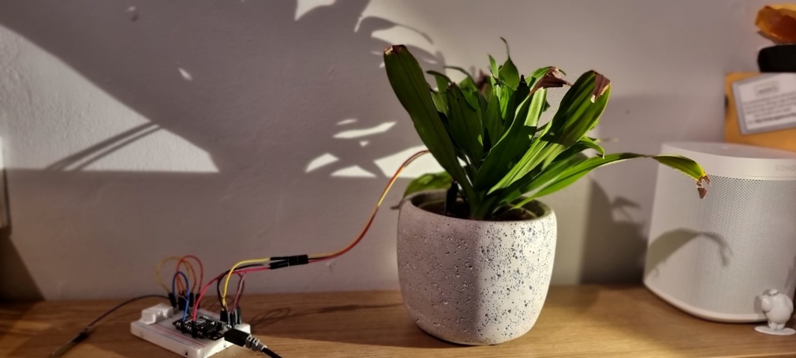
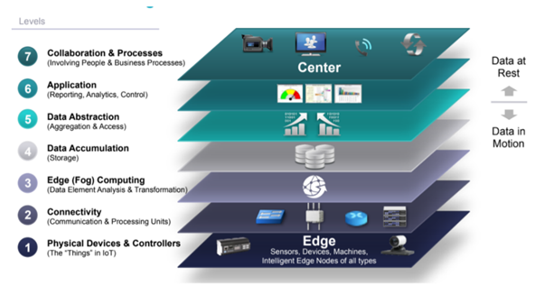
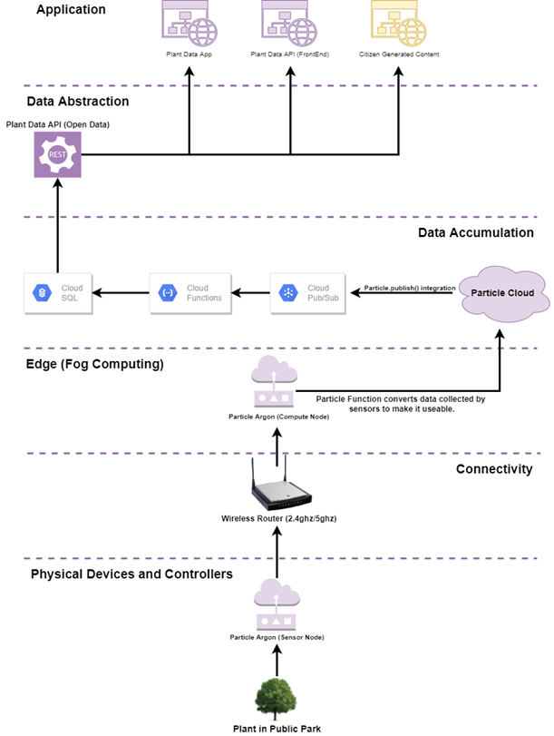
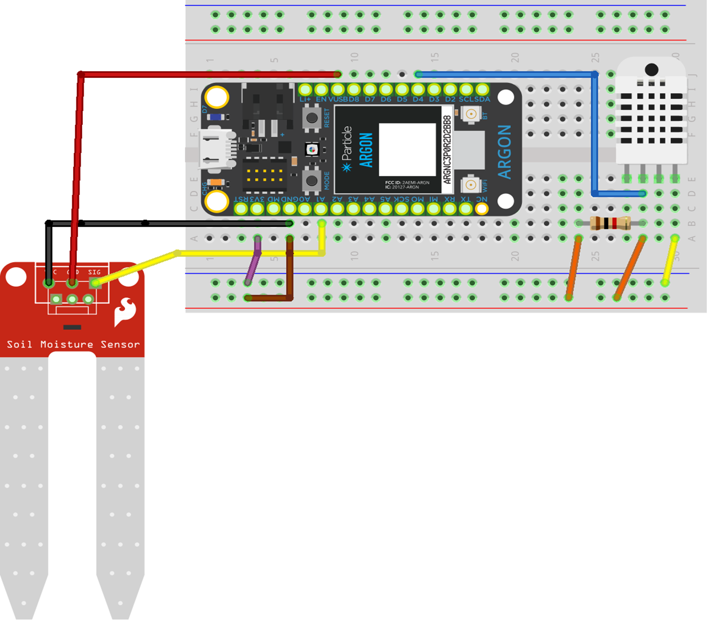
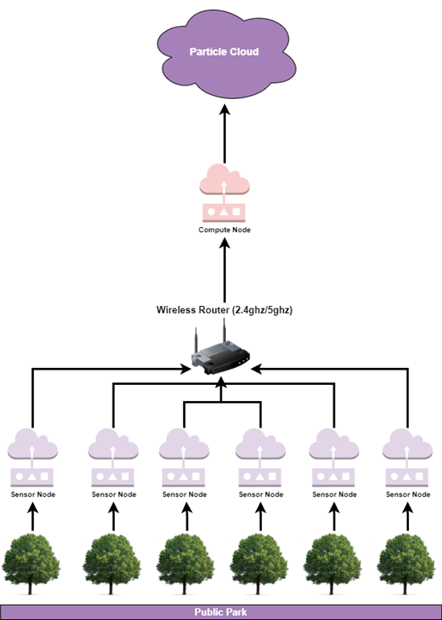
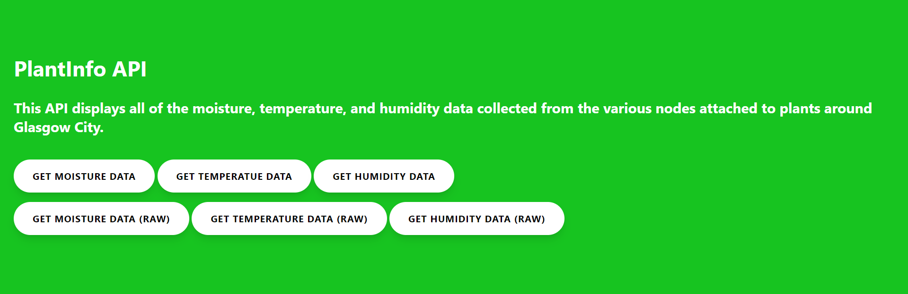

# PlantData API (Internet of Things Project)

*Note that only the code is available now. 
** An academic version of this report can be found at **https://drive.google.com/file/d/13ChxgQNwqo7iUmK6vIQ-C7bo9vQVCH-h/view?usp=sharing**

This is a simple project I built as part of my Internet of Things module in 3rd year of my BSc Software Engineering Degree at Edinburgh Napier University.

I chose to develop the project with the 'smart-city' IoT domain which is probably the most broad domain. 

As such I decided to focus on one aspect of a city - it's public parks. The following sections details how I designed a prototype that would allow a city to collect and share data about the plants kept in these parks. In particular, I looked at how a city could implement an open-source IoT soloution to encourage collaboration within the municipality. 



### Architecture 
When developing something within the smart-city domain it is almost impossible to find a ubiqutious architecture to base your system upon due to the fact that each city has its own numerous variables to consider. Given this, I opted to ammend an already existing architecture (Cisco's IoT Reference Model) to meet the specific needs of my project. 



Using this architecture, I constructed one that made sense for the scope of my project: 



Using this architecture, I then endeavoured to begin work on the physical component of the project.

### Hardware

As an IoT assignment the project utilises some simple sensors to collect data about a plant and it's surroundings and sends this data to the cloud to be used. The data collected includes:

1. The soil moisture of a plant (collected by a **soil moisture sensor** )
2. The humidity of the immediate area surrounding the plant (collected by a **DHT22 sensor**)
3. The temperature of the immediate area surrounding the plant (collected by a **DHT22 sensor**)
4. The edge processing is completed by a Particle Argon which publishes the data to the cloud.



The following image is a graphical representation of how I hope the system would work in the real world.



### Software 
#### Edge Processing

After the data was collected by the Argon some edge processing was necessary to configure the data for use. The following code snippet (written in C) shows how this was done on the particle cloud. 

``` C
// This #include statement was automatically added by the Particle IDE.
#include <Adafruit_DHT.h>

#define DHTPIN 2 
#define DHTTYPE DHT22


//Declaring Global Variables
const int detectPin = A1; //Pin
float detectedValueAnalog; //Pin reading
double temp; 
double humidity;
float moisturePercentage;
String plantStatus;
String data;


DHT dht (DHTPIN, DHTTYPE); //Sets up the DHT22 Sensor

void setup(){
    
    //Declaring the pin mode and initialising the DHTT22 sensor
    pinMode(detectPin, INPUT);
    dht.begin();
    
    //Declaring Particle Console Variables 
    Particle.variable("temperature", temp);
    Particle.variable("humidity", humidity);
}
    

//Collects the data using the getMoisture() method and readSensor() method and publishes the data to the Particle cloud as three distinct data points to be passed on to gCloud and stored in a MySQL database. 
void loop () {
    
    detectedValueAnalog = analogRead(detectPin);//Check
    readSensor(); //Checks for humidity and temperature
    getMoisture(); //Checks for the moisture levels of the soil 
    publishData(); //Publishes the data that has been collected
    delay(60000); //delays the next group of publishes by 60 seconds before looping through the method again
}

//** Methods **//
//This method publishes the data to the cloud
void publishData(){
    Particle.publish("moistureData", String(moisturePercentage)); //Publishes moisture data to the cloud
    delay(20000); //delays next publish by 20 seconds
    Particle.publish("tempData", String(temp));
    delay(20000); //delays next publish by 20 seconds
    Particle.publish("humidityData", String(humidity));
    delay(20000); //deays next publish by 20 seconds
}

//This method checks the moisture sensor and converts the data into a percentag and passes it to a global variable to ensure it can be interpreted by the end-user
void getMoisture() {
    detectedValueAnalog = analogRead(detectPin); //Checks pin for data
    moisturePercentage = (100 - ((detectedValueAnalog/4095.00) * 100)); //Gets the moisture and converts it to a percentage
}


//This method checks the humidity and temperature using ther DHT22 sensor and passes it to some global variables
void readSensor () {
    humidity = dht.getHumidity(); //Gets the humidity from the sensor
    temp = dht.getTempCelcius(); //Gets the temp from the sensor
}

```
Once the edge processing was complete, I made use of the `Particle.publish()` method to publish the data to the data to the particle cloud. This was then passed to the Google Cloud using the the provided gCloud PubSub integration.

#### Google Functions & MySQL Database

In order to save the data and access it anywhere a Database had to be configured. Knowing that I intended to use Prisma within a WebApp to query this database I opted to use a MySQL database even though I would have prefered to use a NoSQL option like the one provided by Firebase. 

After configuring the database I enabled a PubSub listener in the gCloud for each type of data and published by the particle cloud and sent this data to a gCloud function. The following code snippet is representative of the cloud functions: 

``` py
import base64
import pymysql
from pymysql.err import OperationalError
from os import getenv

# TODO(developer): specify SQL connection details by replacing
# root_password, database_name and connection_name with your values
mysql_config = {
  'user': 'root',
  'password': 'password',
  'db': 'plant_data',
  'charset': 'utf8mb4',
  'cursorclass': pymysql.cursors.DictCursor,
  'autocommit': True
}
CONNECTION_NAME = 'plantsensor:europe-west2:plant-sensor-data'

# Create SQL connection globally to enable reuse
# PyMySQL does not include support for connection pooling
mysql_conn = None


def __get_cursor():
    """
    Helper function to get a cursor
      PyMySQL does NOT automatically reconnect,
      so we must reconnect explicitly using ping()
    """
    try:
        return mysql_conn.cursor()
    except OperationalError:
        mysql_conn.ping(reconnect=True)
        return mysql_conn.cursor()


def save_data(event, context):

    pubsub_message = base64.b64decode(event['data']).decode('utf-8')
    datestring = event['attributes']['published_at']

    query  = "INSERT INTO humidity_data VALUES ('"
    query += context.event_id + "', '"
    query += event['attributes']['device_id'] + "', '"
    query += event['attributes']['event'] + "', '"
    query += pubsub_message + "', "
    query += "STR_TO_DATE('" + datestring[0:len(datestring)-1] + "000', '%Y-%m-%dT%H:%i:%s.%f')" + ");"
    print(query)

    global mysql_conn

    if not mysql_conn:
        try:
            mysql_conn = pymysql.connect(**mysql_config)
        except OperationalError:

```

Each of the gCloud functions took the data from the PubSub message and converted it into a MySQL insert statement. This way each time a data point was published by the particle cloud the function would be invoked and the data would be automatically added to the MySQL database to the corresponding Table. 


#### PlantData API 

Once the data was streaming to the MySQL database I decided that the best way to ensure there was a further layer of abstraction between the potential end-user and the database was to create an API that provided only the most essential information. This also neatly fit in with the IoT domain I had selected as part of the assignment - Smart Cities - as in my research I discovered that one of the main tenets of developing a smart city is providing Open Source data for others to use in creative ways. 



The front-end of the API provides two ways for a potential developer to access the data: 

1. A button which opens up a new tab and provides json data in it's raw format.
2. A button which displays the json data on the page and allows the user to copy and paste this data if they so desire. 

##### How was this achieved?

A number of technologies were used to achieve this. Including:

1. HTML
2. CSS
3. Prisma.js
4. Netlify cli

The GitHub repository for this API can be found here: **https://github.com/TomMcEachan/PlantInfoAPI**


#### Plant Data - Front End 

Using this API I constructed a simple web app prototype to exemplify one way this data could be used by a developer in an Open Source project. 


##### How was this achieved?

Like the API a number of technologies were used to achieve this, including:

1. React.js 
2. HTML
3. Custom CSS
4. Axios.js
5. StyledComponents.js
6. Material UI
7. Victory.js 
8. Firebase Hosting 


